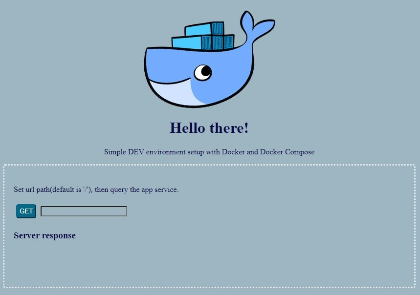

# Containerized Python Development Environment

A simple containerized environment setup with Docker and Docker Compose comprising of a Python app with MySQL running on NginX.

## Build Process
1. Clone this repository.
2. Build and run with `$ docker-compose up -d`
3. Or to perform them separately:
   - `docker-compose build`
   - `docker-compose up -d`

## Result

If everything builds successfully and starts, then point your browser to `http://localhost` to verify successful deployment of the environment with the following page rendered:

### Reference
Followed a series of blog posts from [here](https://www.docker.com/blog/tag/python-env-series/) to create this repository.

